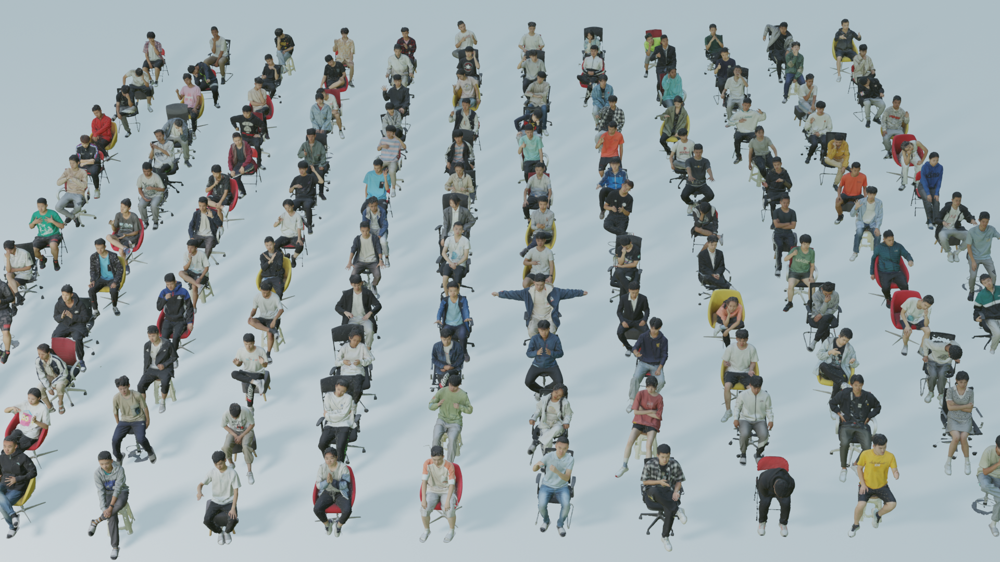
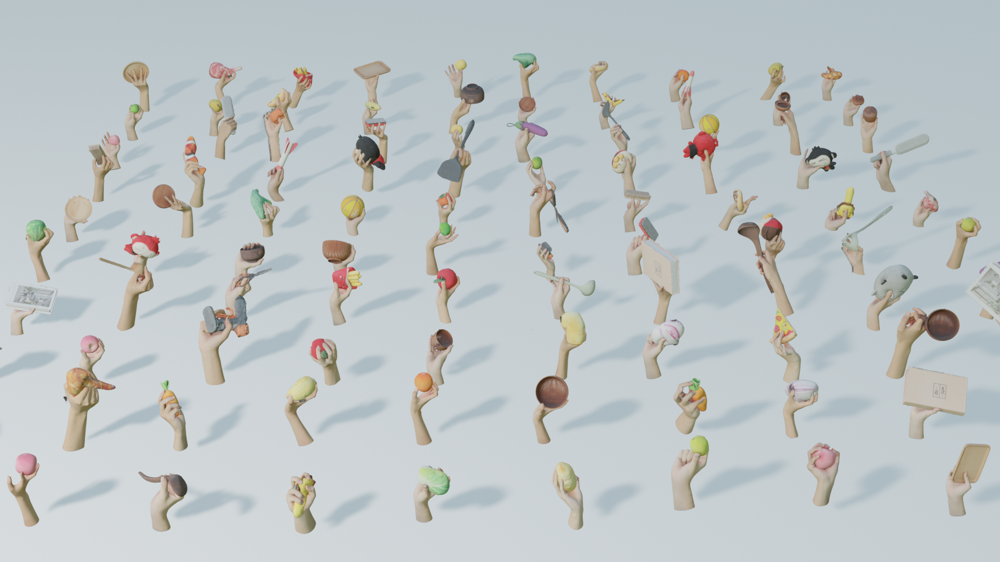

# Ins-HOI: Instance Aware Human-Object Interactions Recovery
Jiajun Zhang, Yuxiang Zhang, Hongwen Zhang, Boyao Zhou, Ruizhi Shao, Zonghai Hu, Yebin Liu.  TPAMI 2025

[[Project Page]](https://jiajunzhang16.github.io/ins-hoi) [[Paper]](https://arxiv.org/abs/2312.09641)


## Dataset

### Demo 

<p align="center">
  
  
</p>

### Agreement

1. The THUman-Ins-Sit and THUman-Ins-Grasp dataset is available for **non-commercial** research purposes only. Any other use, in particular any use for commercial purposes, is prohibited. This includes, without limitation, incorporation in a commercial product, use in a commercial service, as training data for a commercial product, for commercial ergonomic analysis (e.g. product design, architectural design, etc.), or production of other artifacts for commercial purposes including, for example, web services, movies, television programs, mobile applications, or video games. The dataset may not be used for pornographic purposes or to generate pornographic material whether commercial or not. The Dataset may not be reproduced, modified and/or made available in any form to any third party without Tsinghua University’s prior written permission.

2. You agree **not to** reproduce, modified, duplicate, copy, sell, trade, resell or exploit any portion of the images and any portion of derived data in any form to any third party without Tsinghua University’s prior written permission.

3. You agree **not to** further copy, publish or distribute any portion of the Dataset. Except, for internal use at a single site within the same organization it is allowed to make copies of the dataset.

4. Tsinghua University reserves the right to terminate your access to the Dataset at any time.

### Download Instructions

The dataset is encrypted to prevent unauthorized access.

Please fill the [request form_for_Ins-Sit](./dataset/ins-sit_Agreement.pdf),  [request form_for_Ins-Grasp](./dataset/ins-grasp_Agreement.pdf) and send it to Yebin Liu (liuyebin@mail.tsinghua.edu.cn) and cc Jiajun Zhang (jiajun.zhang@bupt.edu.cn) to request the download link. 

By requesting for the link, you acknowledge that you have read the agreement, understand it, and agree to be bound by them. If you do not agree with these terms and conditions, you must not download and/or use the Dataset.

### Data Explanation

**THuman-Ins-Sit** Dataset comprises 4700 high-fidelity human interacting with chairs scans, involving 72 subjects (12 females and 60 males). Each subject seated on 2 of 11 chair types and perform 60 poses. For each scan, we provide the 3D model (****.obj) , the corresponding texture map (material_0.png) and  the SMPL-X fitting parameters (param.pth) and corresponding meshes (SMPL-X.obj). 

**THuman-Ins-Grasp** Dataset contains 500 high-fidelity hand interacting with object scans, involving 50 object types (rigid and soft). Each object involved in 10 distinct interactions, and 20 volunteers participating in the data acquisition. For each scan, we provide the 3D model (****.obj), the corresponding texture map (material_0.png) , the MANO fitting parameters (mano_param.pth)  and the NIMBLE fitting parameters (nimble_param.pth)

We also provide individual chair meshes and object meshes in Dataset.

### Related Datasets from THU3DV Lab [[Link]](http://liuyebin.com/dataset.html)


## Citation

If you use this dataset for your research, please consider citing:

```
@article{zhang2025ins,
  title={Ins-hoi: Instance aware human-object interactions recovery},
  author={Zhang, Jiajun and Zhang, Yuxiang and Zhang, Hongwen and Zhou, Xiao and Zhou, Boyao and Shao, Ruizhi and Hu, Zonghai and Liu, Yebin},
  journal={IEEE Transactions on Pattern Analysis and Machine Intelligence},
  year={2025},
  publisher={IEEE}
}
```

## Contact

- Jiajun Zhang [(jiajun.zhang@bupt.edu.cn)](mailto:jiajun.zhang@bupt.edu.cn)
- Yebin Liu [(liuyebin@mail.tsinghua.edu.cn)](mailto:liuyebin@mail.tsinghua.edu.cn)

